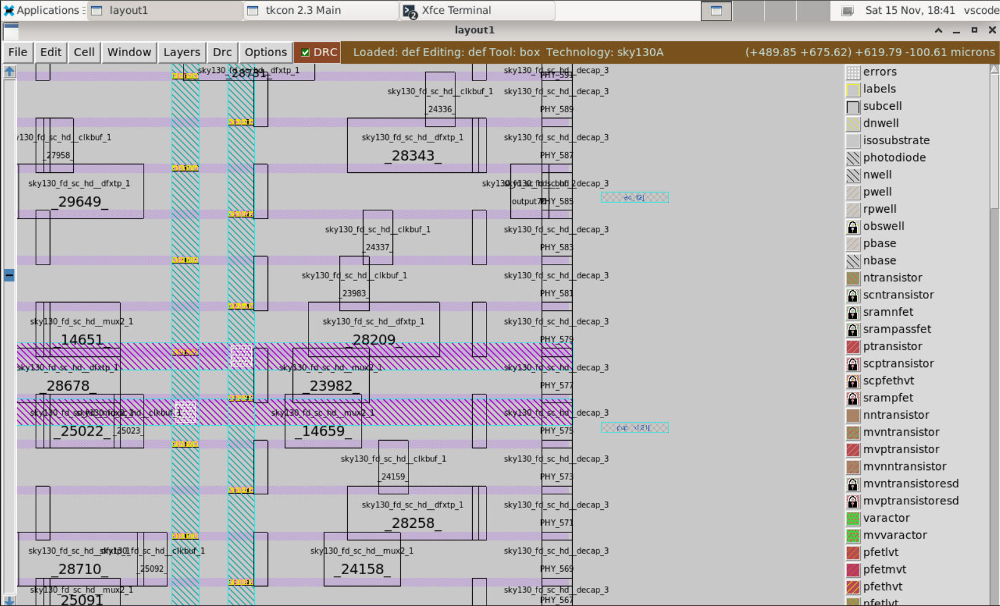
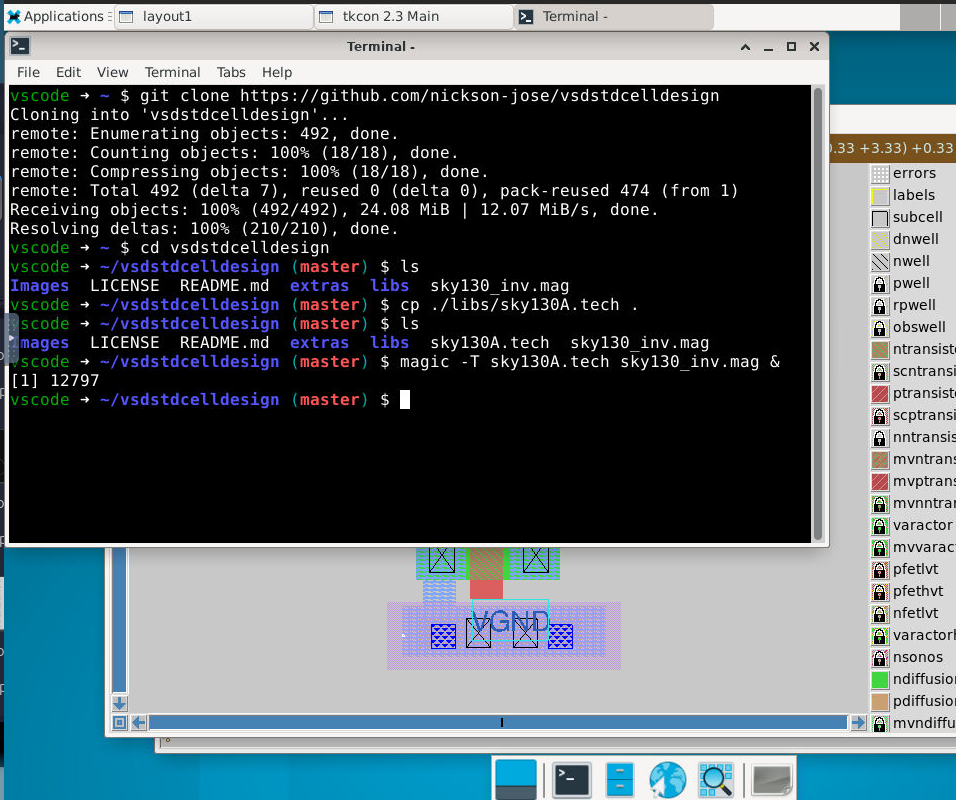
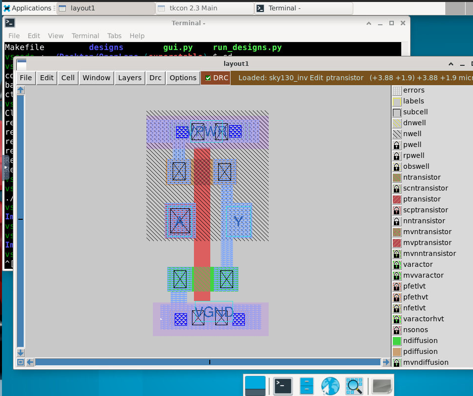
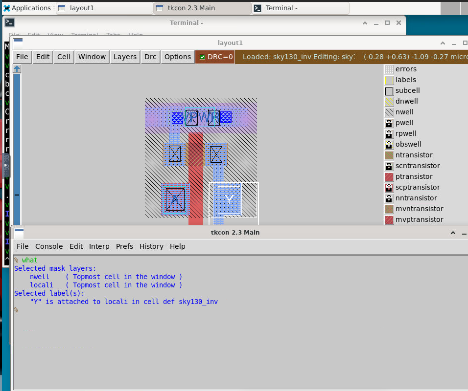
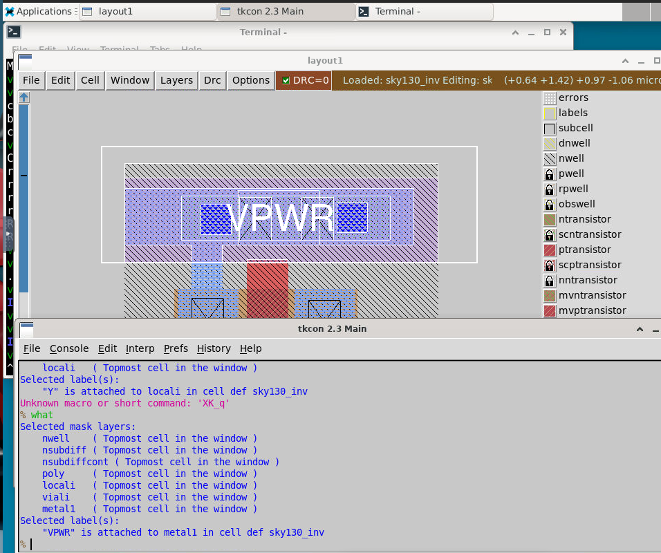
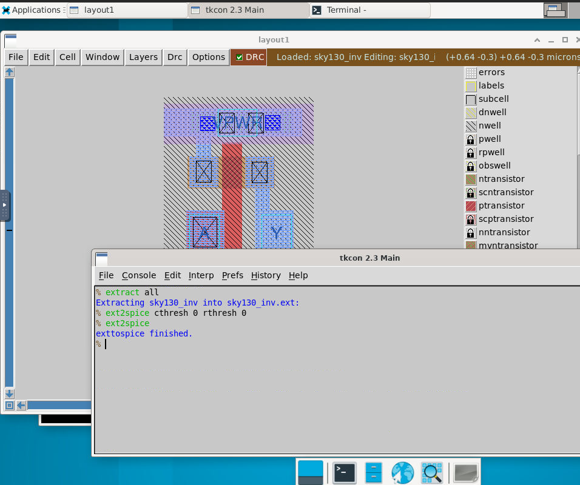
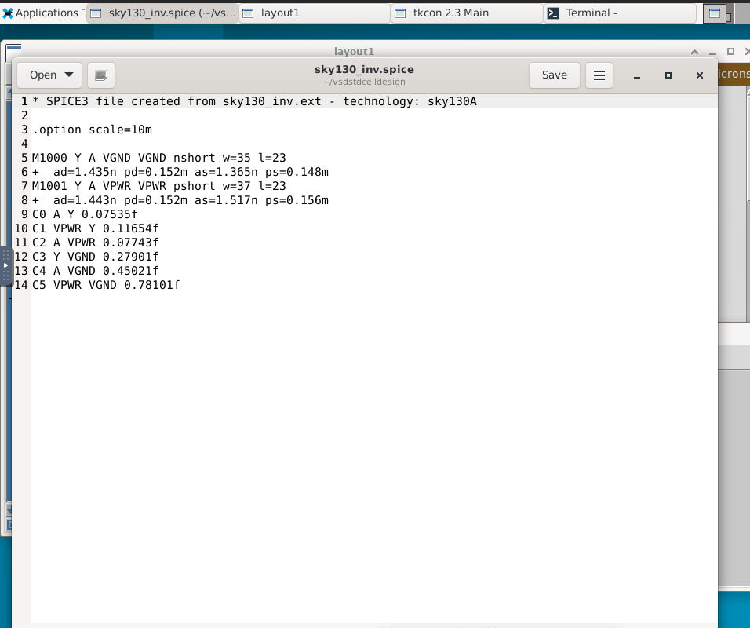
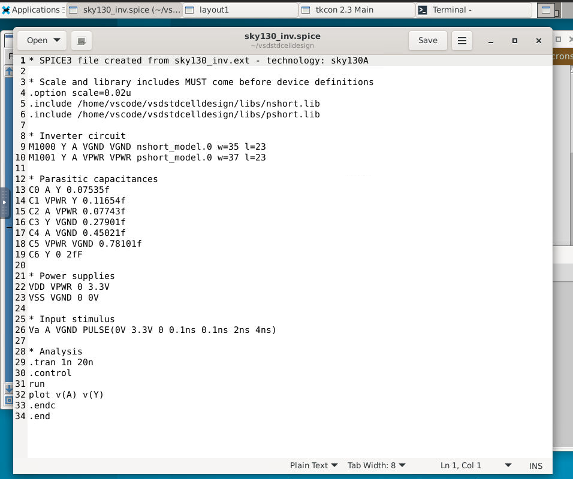
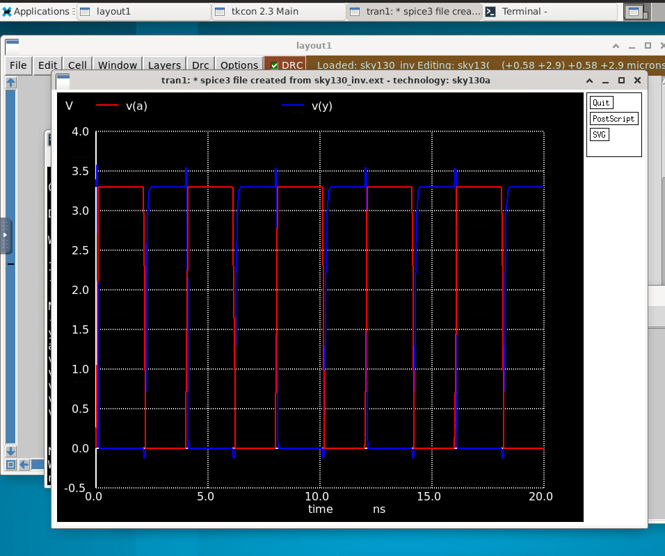

---

# OpenLane SkyWater 130nm Workshop

> A comprehensive two-week workshop covering the complete open-source RTL-to-GDSII SoC design flow. Participants work with OpenLANE, SkyWater's SKY130 PDK, and industry-standard tools (Yosys, Magic, TritonRoute, OpenROAD/OpenSTA) to implement, verify, and physically realize a RISC-V core (picorv32a). The workshop includes custom standard cell design, characterization, and comprehensive sign-off validation (timing analysis, DRC/LVS checks, post-route verification).

---

## Table of Contents

* [Labs](#labs)
    * [Day 1](#day---1)
    * [Day 2](#day---2)

---

## Labs

---

## **Day – 1**

### **Design Preparation**


**Docker container initialization**

```bash
make mount                    # Execute from ~/Desktop/OpenLane/
./flow.tcl -interactive       # Launch interactive OpenLANE session
```

---

### **Design Synthesis**


```tcl
run_synthesis
```

---

### **Task 1 – Flip-Flop Ratio Analysis**

```
Flip-flop ratio calculation:

DFF count = 1613
Total cell count = 15762
Flop Ratio = 1613 / 14876 = 0.102334
DFF Percentage ≈ 10.23%
```

---

## **Day – 2**

### **Floorplanning and Placement Execution**

---

### **Design Floorplan**

```tcl
run_floorplan
```


---

### **Cell Placement**

```tcl
run_placement
```




---

## **Day – 3**

### **Custom Cell Design with Magic and Ngspice**

```bash
# Clone custom inverter design repository
git clone https://github.com/nickson-jose/vsdstdcelldesign

# Navigate to repository
cd vsdstdcelldesign

# Copy Magic technology file for convenient access
cp ./lib/sky130A.tech .

# Verify repository contents
ls

# Launch Magic with custom inverter layout
magic -T sky130A.tech sky130_inv.mag &
```



Custom inverter layout visualization in Magic







> Make sure the model name is changed to nshort_model.0 or nshort_model.{number} number= 0 - 60



```bash
#command to run the spice file
ngspice sky130_inv.spice
```

### Rise transition time

Rise transition time is defined as the time difference between when the output reaches 80% and 20% of its final value:

Rise time = t(80%) − t(20%)

- 20% of output = 660 mV
- 80% of output = 2.64 V

As per the graph t(20%) = 2.2ns
Similarly t(80%) = 2.3ns

Rise time = 2.3 - 2.2 = 0.1ns

