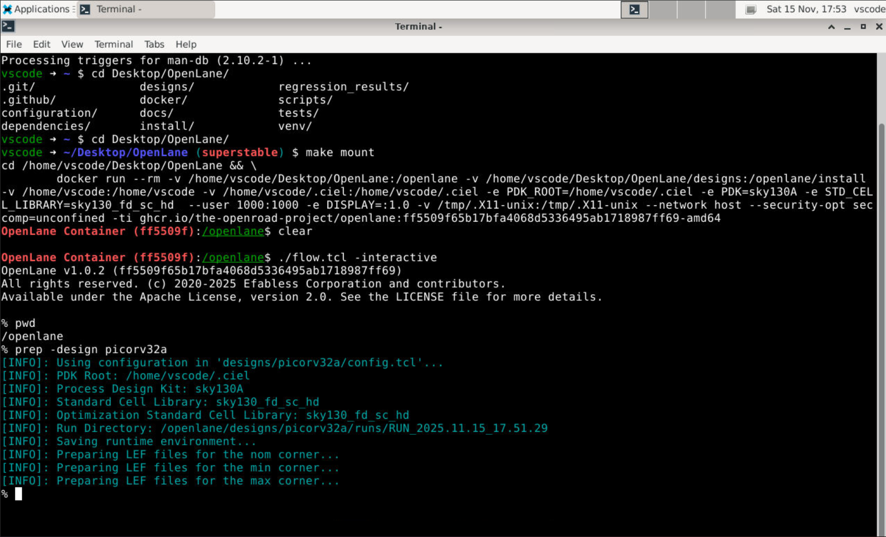
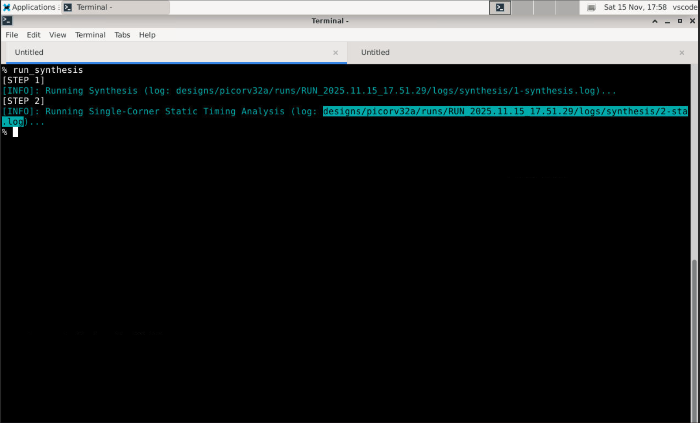
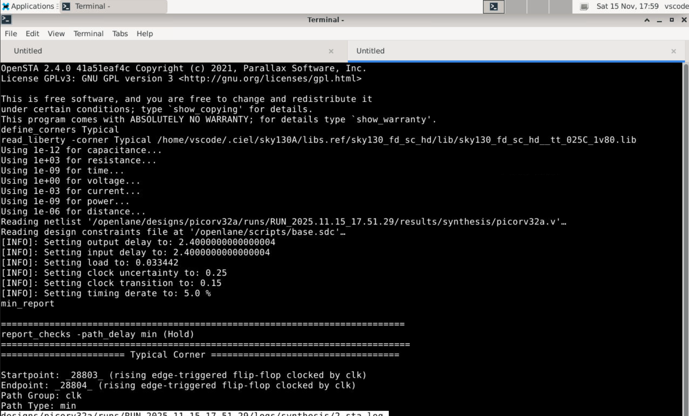
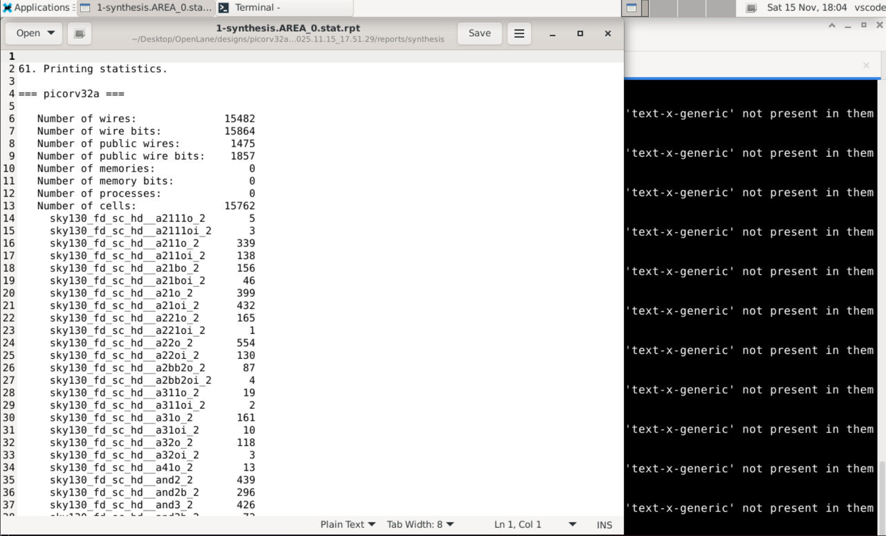
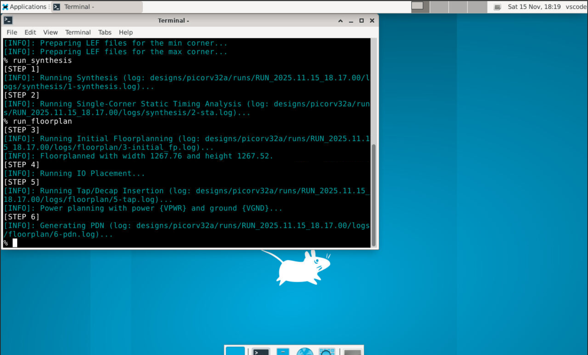
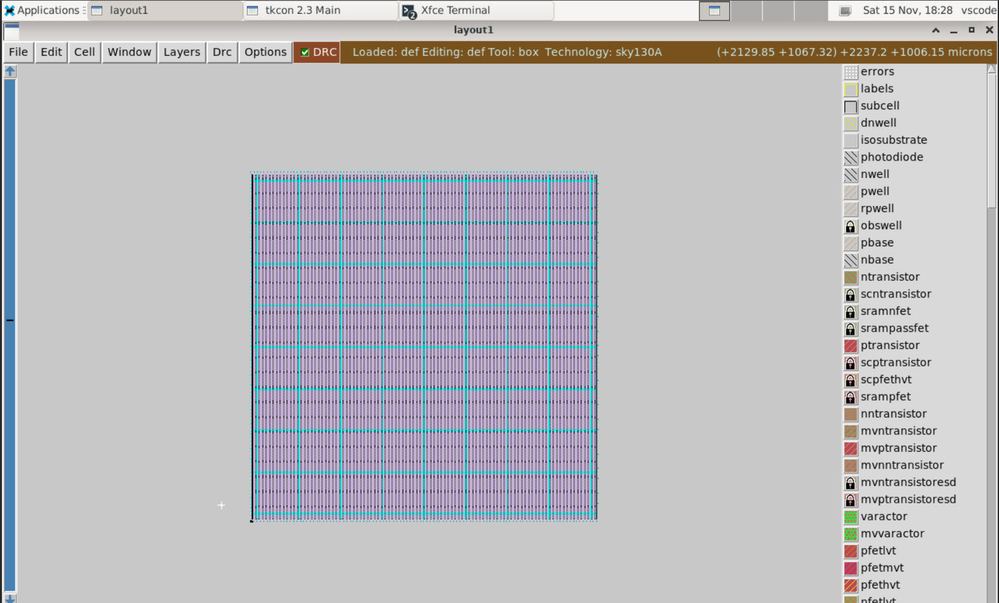
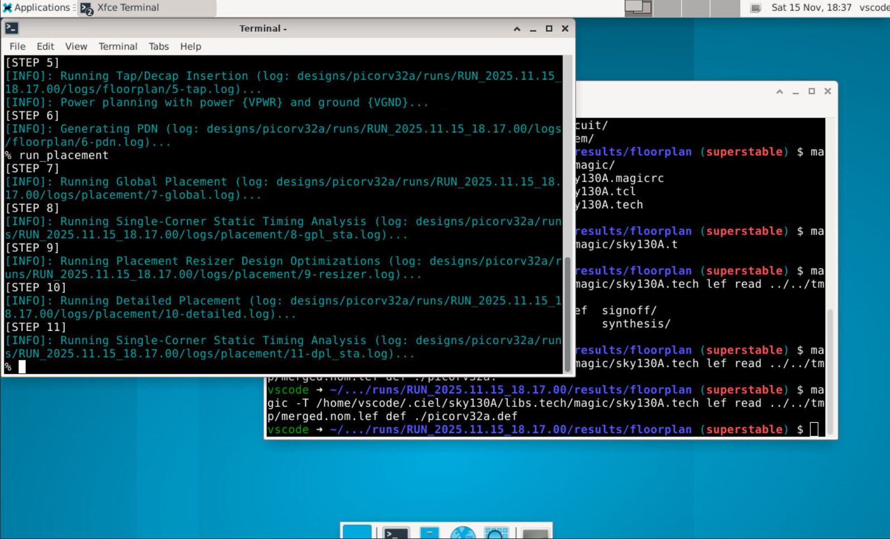
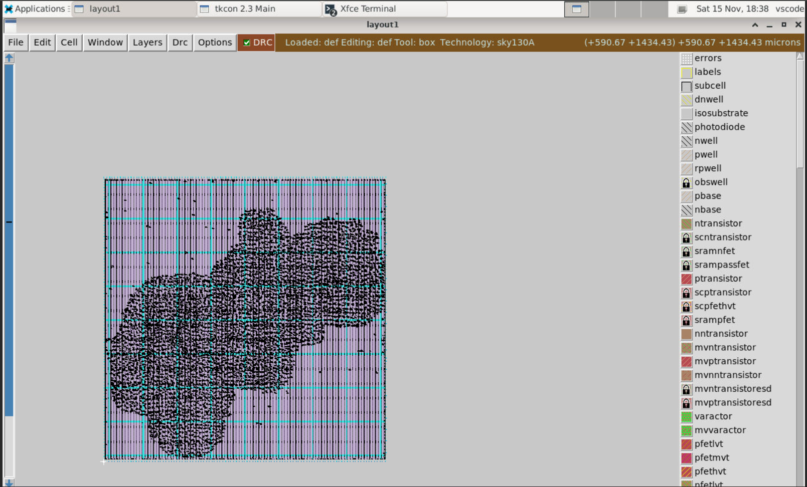
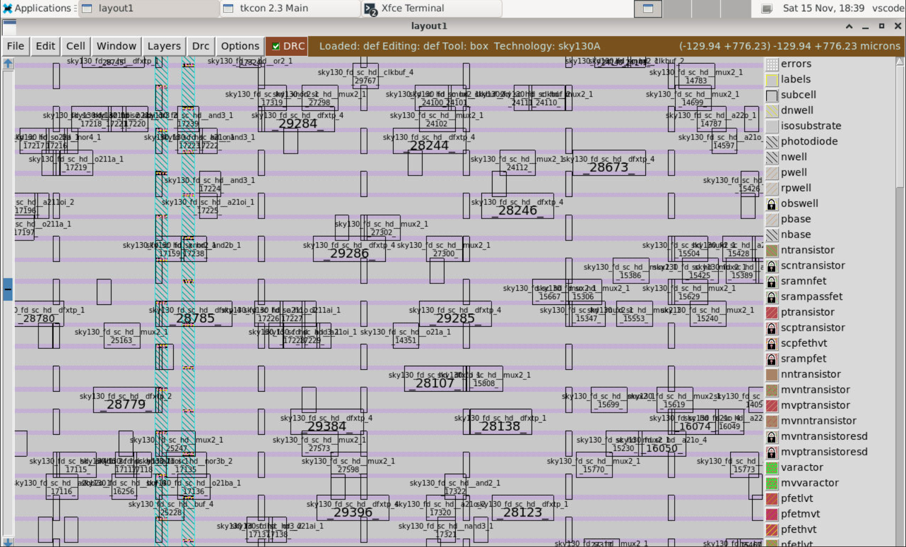

# Openlane SkyWater 130nm Workshop 
> A two-week hands-on workshop that guides participants through a complete open-source RTL→GDSII SoC flow. Using OpenLANE, SkyWater’s SKY130 PDK and tools like Yosys, Magic, TritonRoute and OpenROAD/OpenSTA, students implement, verify and physically realize a RISC-V core (picorv32a), create and characterize custom standard cells, and perform timing, DRC/LVS and post-route sign-off tasks.

## Table of Content

## Labs

### Day - 1

#### Preping design 


Command to start docker container

```
make mount # Run this inside the ~/Desktop/OpenLane/
./flow.tcl -interactive # to start interactive session 
```

Synthesize the design 




```
run_synthesis
```

> Task 1
```
Calculate the flop ratio:

Number of DFFs = 1613
Total number of cells = 15762
Flop Ratio = 1613 / 14876 = 0.102334
DFF % ≈ 10.2334%
```

### Day - 2

#### Running Floor Plan and Placement
Floorplan of the design 

```
run_floorplan
```




Placement of the design 
```
run_placement
```



